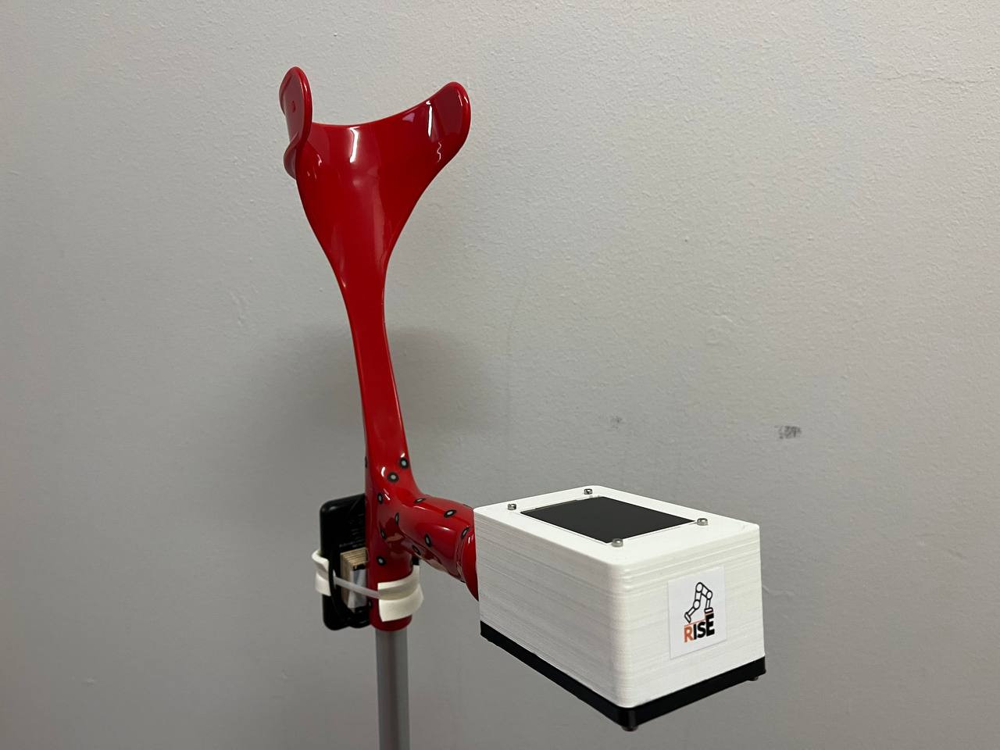
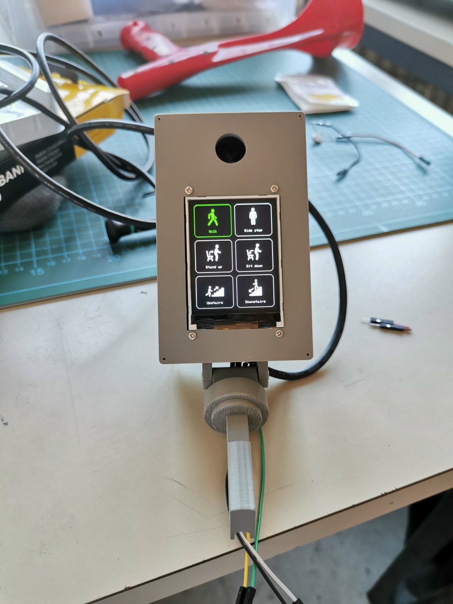
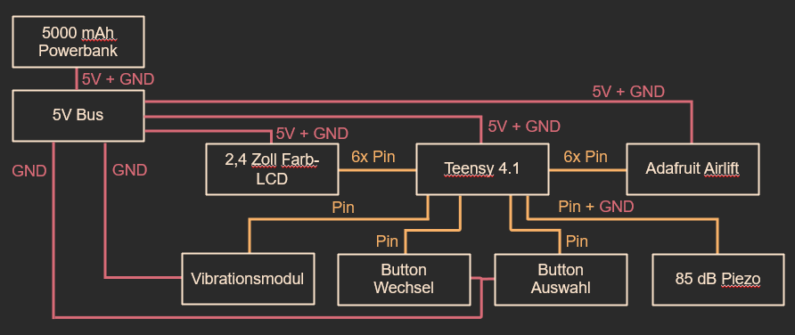
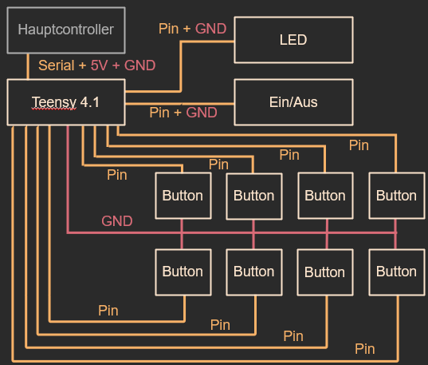
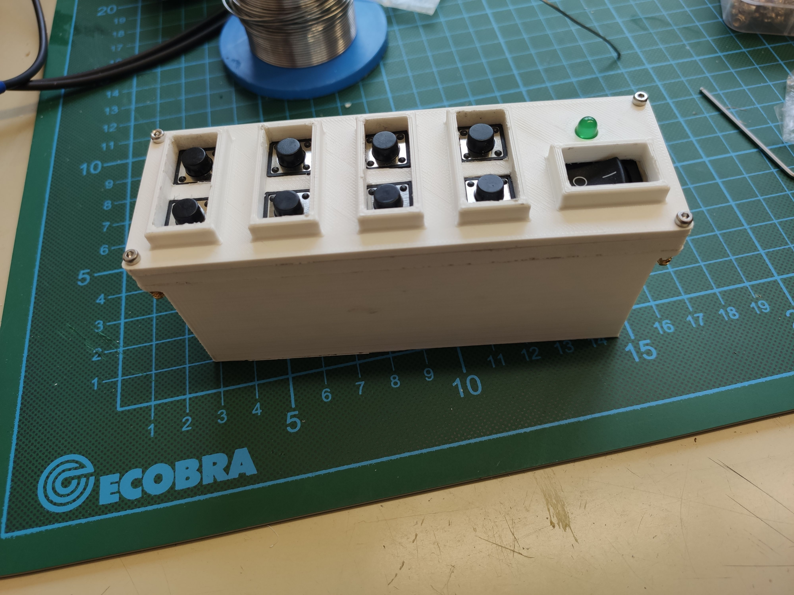

# RISE UI - Exoskeleton UI ([TU Berlin RISE SoSe 2023](https://blogs.tu-berlin.de/mt_rise/en/home/))

<figure>
  
  <figcaption>Fig.1 - Main UI </figcaption>
</figure> 

## Project
* development of an UI for a 4-DOF lower limb exoskeleton 
* communication to exo main controller via WiFI (ESP32 Adafruit Airlift Module)
* "Single Actuator Control Unit" (SACU) for manual control of actuators

## Firmware 
* UI Control with Teensy 3.6
* WiFi Connection with ESP32 Adafruit Airlift Module 
* programming via ArduinoIDE
* 2 buttons to toggle and activate one of the 6 available modes
* see Program Flow Chart for code structure  

 

<figure>
  
  <figcaption>Fig.2 - Modes Exoskeleton </figcaption>
</figure> 

 
 

## EDA
* Schematics with Eagle 9.6.2
 

<figure>
  
  <figcaption>Fig.3 - Block Diagram Main UI </figcaption>
</figure> 

 
 
 

<figure>
  
  <figcaption>Fig.4 - Block Diagram SACU </figcaption>
</figure> 

 
 

## 3D 
<figure>
  
  <figcaption>Fig.5 - 3D-printed SACU case </figcaption>
</figure> 

