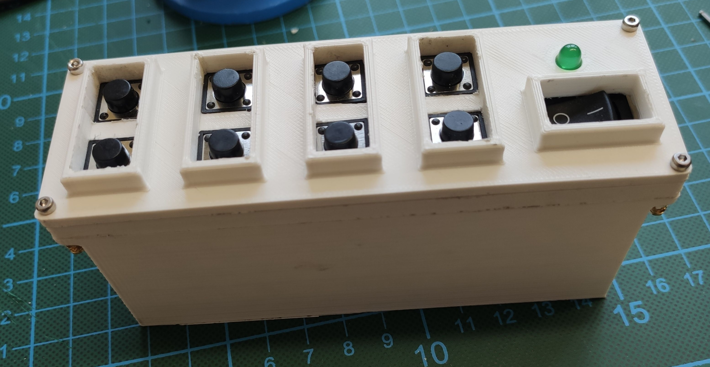

# RISE UI - Exoskeleton UI (TU Berlin RISE SoSe 2023)

<figure>
  
  <figcaption>Fig.1 - Main UI </figcaption>
</figure> 

## Project
* develop a UI for a 4-DOF lower limb exoskeleton
* wireless communication to main controller via WiFi
* "Single Actuator Control Unit" (SACU) for manual control of actuators

## Firmware 
* Teensy 3.6 with ArduinoIDE
* 2 buttons to toggle and activate one of the 6 available modes

 

<figure>
  
  <figcaption>Fig.2 - Modes Exoskeleton </figcaption>
</figure> 

 
 

## EDA
* Schematics with Eagle 9.6.2
 

<figure>
  
  <figcaption>Fig.3 - Block Diagram Main UI </figcaption>
</figure> 

 
 
 

<figure>
  
  <figcaption>Fig.4 - Block Diagram SACU </figcaption>
</figure> 

 
 

## 3D 
<figure>
  
  <figcaption>Fig.5 - 3D-printed SACU case </figcaption>
</figure> 

